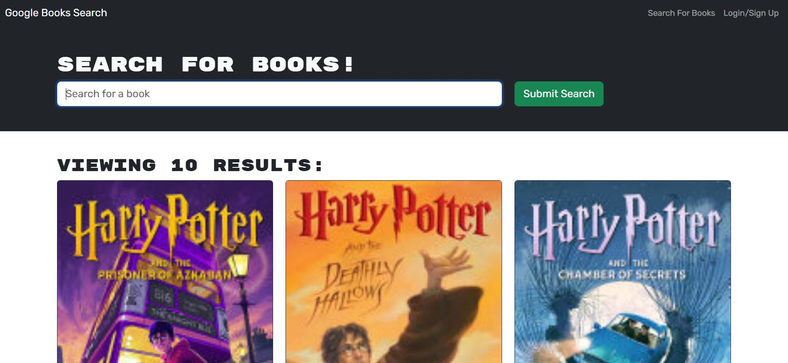

# Book Search Engine

## Description
This project involves refactoring an existing Google Books API search engine to modernize its architecture and improve performance by leveraging GraphQL. Originally built using the MERN stack (MongoDB, Express.js, React, and Node.js) with a RESTful API, the application allows users to search for books and save their searches to a MongoDB database. This project aims to modernize the book search engine by embracing the latest in web development practices, making it both a learning exercise in GraphQL and a practical enhancement of a real-world application.

## Table of Contents
- [Installation](#installation)
- [Usage](#usage)
- [Credits](#credits)
- [License](#license)
- [How to Contribute](#how-to-contribute)
- [Tests](#tests)

## Installation
This project does not require an installation. However, you are welcome to to either clone the repository and access the project files or fork the repo.

## Usage
Deployed on 

## Credits
Andres Albornoz

## License
This project is unlicensed.
